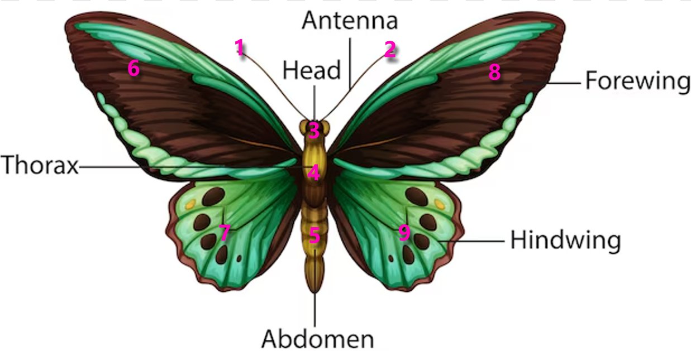
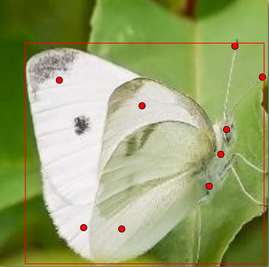
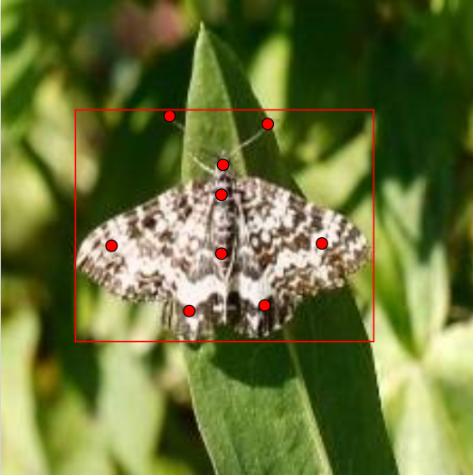
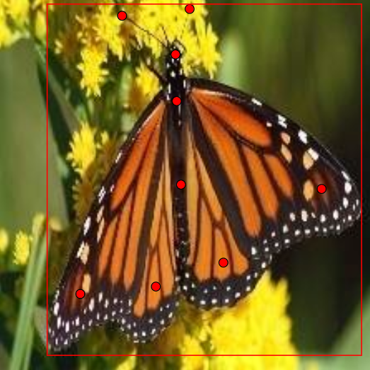

# 🦋 **Butterfly Keypoint Detection with YOLOv8**

This project fine-tunes a YOLOv8 model to detect butterflies and predict their anatomical keypoints. The dataset was custom-created using images sourced from [Butterfly Image Classification Dataset](https://www.kaggle.com/datasets/phucthaiv02/butterfly-image-classification) on Kaggle. The dataset was annotated using the CVAT platform, and the results demonstrate the model's performance on this unique dataset for keypoint detection.

## 🛠️ **Self-Annotated Dataset**
Each butterfly image was annotated through the CVAT platform using these keypoints:

The annotation inculded drawing a bounding box for the butterfly class and defining the keypoints.

*Examples of annotated images:*

After annotation, the data was exported in YOLO format. To make the annotations compatible with YOLOv8, they were further converted into the COCO keypoints format using the script `CVAT_to_cocoKeypoints.py`.

---

## 📂 **Project Structure**

---

## 📊 **Results**